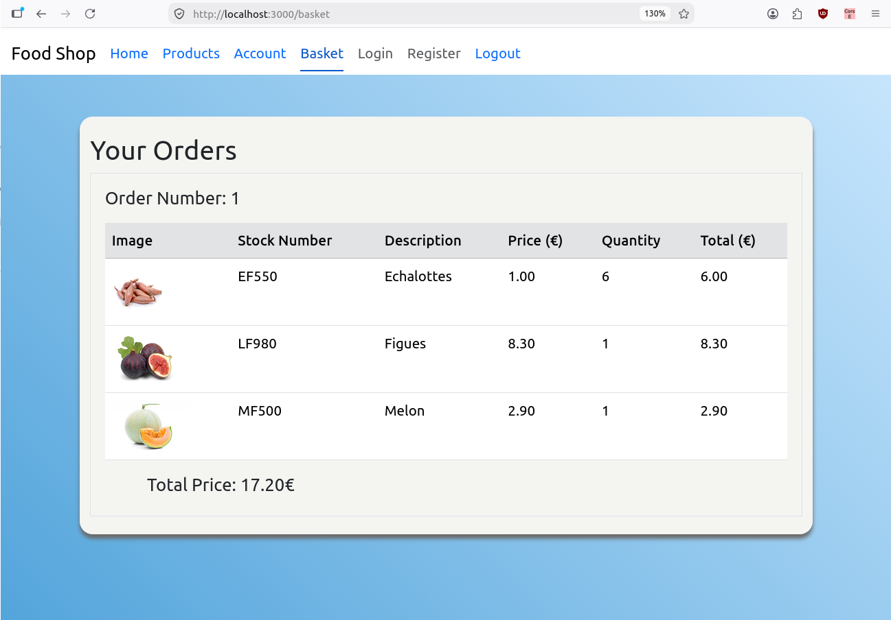

# App for ordering food



## Tech Stack

- .Net Core 9 Web Api.
- Entity Framework Core.
- React 19.
- MySQL.

## Features

- User registration and login
- The user can place orders and view order history
- DTO to avoid exposing sensitive data

## build instruction

1. Install .NET 9 SDK and MySQL Server

2. Create and populate the MySQL database using the createDb.sql script.
   
3. Install dependencies for the front-end:
   ``` 
   cd react-app
   ```
   ```
   npm install
   ```

4. Configure your MySQL connection string in `asp.net-web-api/appsettings.json`.

5. Build and run the ASP.NET Core Web API:
   ```
   cd ../asp.net-web-api
   ```
   ```
   dotnet build
   ```
   ```
   dotnet run
   ```

6. Start the React app:
   ```
   cd ../react-app
   ```
   ```
   npm start
   ```

## Testing

To run the unit tests for the Web API:
```
dotnet test
```

The test suite includes comprehensive tests for:
- ProductsController (product retrieval)
- OrdersController (order creation, order history, authentication)
- UsersController (user registration, login, profile retrieval)
   
   
